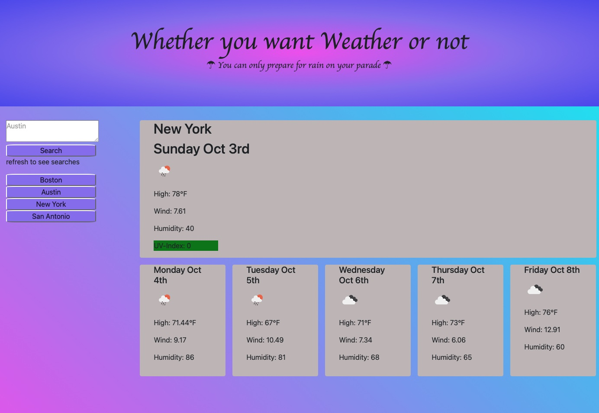

# whether_weather_TT
As the tides turned and the weather took a turn for the worse, the reluctant adventurer desired something more in life.  He thought that his travels would be made easier if he only had a sorcerer companion.  He cried out for one to appear and help him find his way back to more comfortable times.

This sorcerer should be able to tell him what the weather would be like in the coming week for any location that he could potentially reach.  He had fair skin so he also wanted to know the UV-index as well as the humidity, the date, the high temperature and the wind.  Oh,the cursed wind and all the times it had pushed him into uncharted territories and into periless dangers!  This prognosticating wizard would save him!!! 

Alas, no wizard heard his cry, and only a wayward troll came to him.

This troll proceded to create a site that would show the desired information.  He called out for an API to appear and give him the information. The troll froze in time and waited for the request to return to him.  It was like watching someone throw a boomerang and expect nothing to return, but amazingly enough it did, so the troll continued his work.  The adventurer occassionally heard groans from the troll who seemed incredibly distraught over something called a button.  The traveler thought this must be something horrible if a troll is so frustrated with such a thing!  The troll continued his tireless work and made a sacrific to an icon to appear and show the weather.  Just as this happened, the sky turned dark and gray mirroring the mode of the troll.  This weather widget might show the future, but it seems to make the present worse for poor troll.  
After days of the the troll pounding away, he cried out that he was finished! 

The adventurer took the all seeing eyeDevice and looked upon it.  It showed the climate with a mix of garish colors.  He thought to himself that it wasn't perfect, but he wasn't going to ask the troll for anything else!  It seemed to prove that trolls must be colorblind!  

With the weather predicted, the weary adventurer set out once again!  He was thankful to the troll for helping along the way!

### Beautiful images

### The Pages of Destiny

the webpage (https://dertodd.github.io/whether_weather_TT/) and the gitHub (https://github.com/DerTodd/whether_weather_TT)
### sources
Homework
buttons and formulas inspired by:

geeksforgeeks.org

stackoverflow.com

David Cochran at codepen.io

GIVEN a weather dashboard with form inputs
WHEN I search for a city
THEN I am presented with current and future conditions for that city and that city is added to the search history
WHEN I view current weather conditions for that city
THEN I am presented with the city name, the date, an icon representation of weather conditions, the temperature, the humidity, the wind speed, and the UV index
WHEN I view the UV index
THEN I am presented with a color that indicates whether the conditions are favorable, moderate, or severe
WHEN I view future weather conditions for that city
THEN I am presented with a 5-day forecast that displays the date, an icon representation of weather conditions, the temperature, the wind speed, and the humidity
WHEN I click on a city in the search history
THEN I am again presented with current and future conditions for that city
